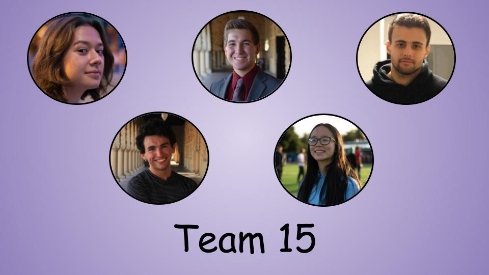

# Team 15 Home

[View our Wiki here
](https://github.com/StanfordCS194/win2023-team15/wiki)

Member | Skills | Personal Traits | Desired Growth | Weaknesses
--- | --- | --- | --- | ---
Cat | Project management, anticipating time needed for a deliverable | Likes to think about ideas from multiple angles & anticipate reactions from a variety of stakeholders; finds value in a balanced use of pleasantries that doesn’t take away from and rather encourages efficiency | Programming  | Public speaking
Dominic | Talking to users, design documentation, computer vision | Prefers clan-based organizations | Industry-calibre coding practices | Modular system design
Jacob | [INSERT SKILLS] | [INSERT PERSONAL TRAITS] | [INSERT DESIRED GROWTH] | [INSERT WEAKNESSES] 
Clemente | [INSERT SKILLS] | [INSERT PERSONAL TRAITS] | [INSERT DESIRED GROWTH] | [INSERT WEAKNESSES] 
Clarisse | project management, data analysis, communication | mediator, enjoys learning new programming languages | programming, user testing | programming, UI/UX design
